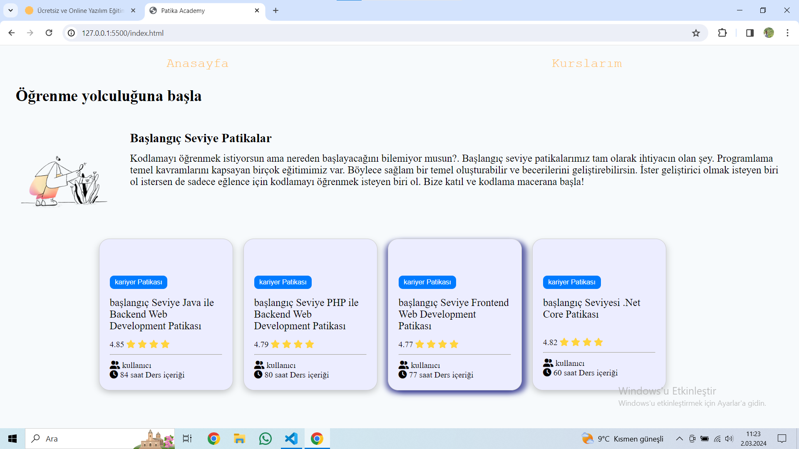

# Yazılım Kursları

Bu proje, kodluyoruz eğitimi kapsamında yazılım geliştirme alanında eğitim almak isteyenler için bir rehber niteliğindedir. Proje içeriği, çeşitli yazılım dilleri ve teknolojileri hakkında bilgi vermek ve öğrenme sürecini yönlendirmek amacıyla hazırlanmıştır.

## Ana Sayfa

Ana sayfa, bu proje için başlangıç noktasıdır. Burada proje hakkında genel bilgiler bulunmaktadır ve kullanıcıları yönlendirmek için gerekli bağlantılar sağlanmıştır.

## Kurslarım

Kurslarım sayfası, mevcut eğitim içeriğini listeler. Her bir kurs, ayrı bir kart şeklinde sunulmaktadır. Kartlar, kursun adını, açıklamasını ve diğer önemli bilgileri içerir.

### Kurs Kartı Örneği

- **Kurs Adı:** Web Geliştirme Patikası
- **Açıklama:** Bu patika, web geliştirme alanında temel ve ileri düzeyde bilgi edinmek isteyenler için tasarlanmıştır. HTML, CSS, JavaScript gibi temel teknolojilerin yanı sıra React, Node.js gibi modern araçlar da içermektedir.
- **Süre:** 12 Hafta
- **Başlangıç Tarihi:** 15 Mart 2024
- **Bitiş Tarihi:** 7 Haziran 2024
- **Ön Koşullar:** Temel programlama bilgisi önerilir.

Her kurs için benzer bir kart bulunmaktadır.

## Kurulum

Bu projeyi yerel bilgisayarınıza klonlayarak veya doğrudan GitHub'dan indirerek kullanabilirsiniz.

## Lisans

[MIT](LICENSE)
